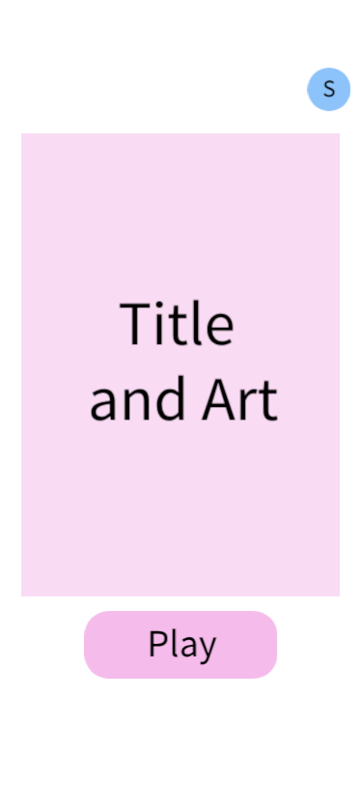
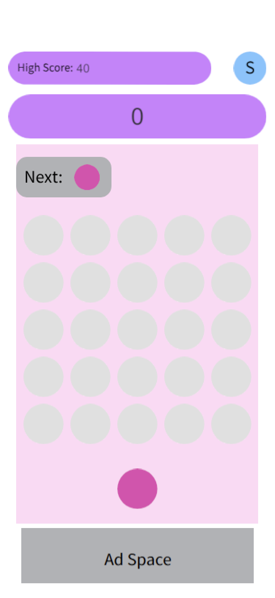
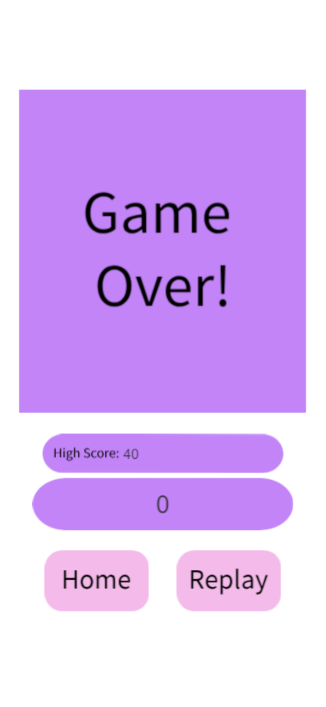
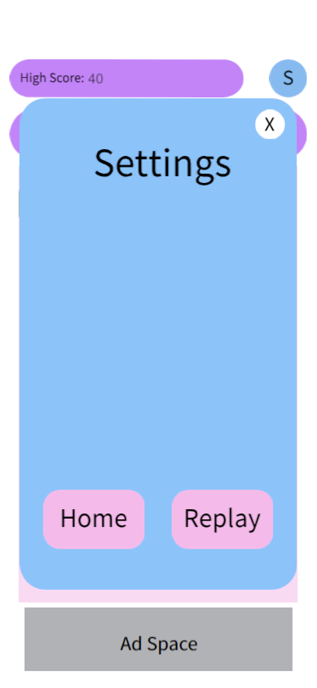

# Shell Smash - Prototype Build

This repo captures an early build of **Shell Smash** (MG1). It was pulled from the commit where the
core gameplay mechanics were finished, before final art, UI polish, or additional systems were 
added. It's included alongside the [finished game](https://github.com/emmag37/MG1.git) as a snapshot of the development process.

## What's in this build

- Core gameplay loop and match/row clear mechanics fully functional
- Bare minimum UI screens and navigation
- Plain shapes and placeholder text standing in for final art and iconography

## What's not in this build

- No audio
- No animations
- No settings options, player profile
- No final graphics

## Screenshots

| Home | Gameplay | Game Over | Pause |
|------|----------|-----------|-------|
|  |  |  | |

## Demo Video

## What came after this build

Most of the development time past this point went into restructuring and rewriting the codebase. Required multiple passes to cleanly fit new systems in as the architecture matured. Features include:

- Real persistence (save/load)
- A custom game object pool
- UI scaling support
- Defensive coding practices (logging and exceptions)

## Why this exists

This build is kept as a reference point to show the evolution of the project from functional mechanics with placeholder visuals to the finished, polished version. It reflects an early milestone: proving the core loop worked before investing in the architecture rewrite, persistence, pooling, UI, art, and audio that followed.

## Related

Check out the finished version of Shell Smash: [link](https://github.com/emmag37/MG1.git)

